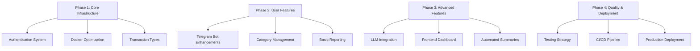

# Enhanced Project Plan

## Validation of Existing Plan
The existing plan in `readme.md` covers the essential features for a cost tracking application. Below are validations and improvements for each point.

## Detailed Improvements

### 1. Authentication (Auth)
- **Validation**: Token-based authentication is essential for API security
- **Improvements**:
  - Implement JWT with refresh tokens using FastAPI's OAuth2PasswordBearer
  - Use `passlib` with bcrypt for password hashing
  - Add user roles for future permission management

### 2. Docker Optimization
- **Validation**: Containerization is crucial for deployment
- **Improvements**:
  - Add multi-stage builds to reduce image size
  - Use Docker Compose profiles for dev/prod environments
  - Implement health checks for database and services

### 3. Income Tracking
- **Validation**: Important for full financial tracking
- **Improvements**:
  - Extend Transaction model with `transaction_type` (income/expense)
  - Add validation for positive/negative amounts
  - Create separate API endpoints for income operations

### 4. Telegram Bot Features
- **Validation**: Core user interaction channel
- **Improvements**:
  - Implement state machine for conversation flow
  - Use Redis for session management
  - Add natural language processing for transaction input

### 5. Category Hierarchy
- **Validation**: Essential for organized tracking
- **Improvements**:
  - Implement nested categories using closure table pattern
  - Add API for category management
  - Create budget tracking per category

### 6. LLM Integration
- **Validation**: Valuable for automated categorization
- **Improvements**:
  - Start with rule-based system before LLM
  - Use Hugging Face's small models for cost efficiency
  - Implement caching for frequent queries

### 7. Frontend
- **Validation**: Needed for comprehensive user experience
- **Improvements**:
  - Use React with Chart.js for visualizations
  - Implement JWT-based authentication
  - Add responsive design for mobile use

### 8. Testing
- **Validation**: Critical for maintainability
- **Improvements**:
  - Add integration tests for API endpoints
  - Implement CI/CD pipeline
  - Include performance testing

## Implementation Roadmap

## Recommended Timeline
1. **Week 1-2**: Complete Phase 1 (Core Infrastructure)
2. **Week 3-4**: Implement Phase 2 (User Features)
3. **Week 5-6**: Develop Phase 3 (Advanced Features)
4. **Week 7**: Finalize Phase 4 (Quality & Deployment)

## Next Steps
1. Prioritize which phase to start with
2. Identify any additional requirements
3. Allocate resources for implementation